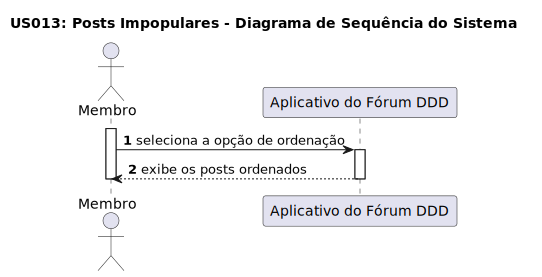

# US 013: Unpopular Posts

## 1. Requirements Engineering

### 1.1. User Story Description

As a user, I want to visualise unpopular posts in ascending order based on the number of votes.

### 1.2. Customer Specifications and Clarifications

**From the specifications document:**

> **Question:** How will the posts be sorted in the user interface?

> **Answer:** 
>  Messages will be sorted by popularity, unpopularity or most recent messages.

> **Question:** 
>  If there are posts with the same number of votes, how will they be sorted?
>
> **Answer:**
>  They will be sorted by the order of publication, with the most recent appearing first.

> **Question:**
>  If the user is not logged in, will he be able to see the sorted posts?
>
> **Answer:**
>  Yes, he will be able to see the sorted posts, but he will not be able to vote.

### 1.3. Acceptance Criteria

* **AC1:** Unpopular posts should be automatically sorted in ascending order by number of votes
* **AC2:** The user must be able to see the number of votes for each post.
* **AC3:** Posts with the same number of votes should be sorted in order of publication, with the most recent being displayed first.

### 1.4. Found out Dependencies

- There are dependencies for "US 002: Create an account" - "US 010: Log in" because the user needs to be authenticated and logged in to access. "US 003: Creat a post" there must be posts in order to be ranked. 

### 1.5 Input and Output Data

**Input Data:**

	
* Selected data:
	* Selected sorting option: Unpopular via the user interface.

**Output Data:**

* List of posts sorted based on the selected option (Unpopular).

### 1.6. System Sequence Diagram (SSD)

### 1.7 Other Relevant Remarks

### 1.9. Sequence Diagram

