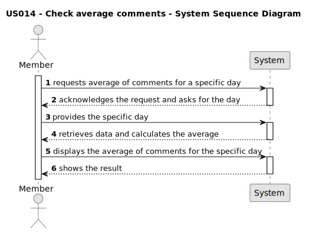

# US 014 - Chek Average Comments 

## 1. Requirements Engineering

### 1.1. User Story Description

As a Member, I wish to know the average of comments for a specific day.

### 1.2. Customer Specifications and Clarifications 

**From the specifications document:**

**From the client clarifications:**

> **Question:** Where can I check the average comments?
>  
> **Answer:** The average comments can be checked in the statistics field, next to the login.

> **Question:** Can I put any date?
>  
> **Answer:** yes, dates up to the current day can be entered.

### 1.3. Acceptance Criteria

** **AC1** The system must have a statistics field for the user to enter a specific date for which they want to calculate the average number of comments.
** **AC2**  The system must calculate the average number of comments for the specified date based on the available data.
** **AC3:** The result of the average comments should be displayed in a way that is clear and understandable to the user.
** **AC4:** The system must round the value of the average comments to an appropriate number of decimal places for clarity, round up.
** **AC5:** The system should handle cases where there were no comments on the specified date and display an appropriate message or value. Message: "No comments found".
** **AC6:** The user should receive feedback within a reasonable time after requesting the average number of comments for the specific date.
** **AC7** The user interface must be user-friendly and allow the user to enter the date intuitively.
** **AC8** The system must perform the calculation based on real data and provide accurate results.
** **AC9** The system must be able to deal with invalid dates (future dates) to guarantee the accuracy of the calculation. Message: "Invalid date"

### 1.4. Found out Dependencies

* There is a dependency to the US 006 - Comment on a post, since the comments are created in that user story.

### 1.5 Input and Output Data

**Input Data:**

* Specific date for which the average of comments is to be calculated.

**Output Data:**

* Value of the average comments for the specified date.

### 1.6. System Sequence Diagram (SSD)

### 1.7 Other Relevant Remarks

* The system should be able to handle different time zones and date formats to ensure calculation accuracy.