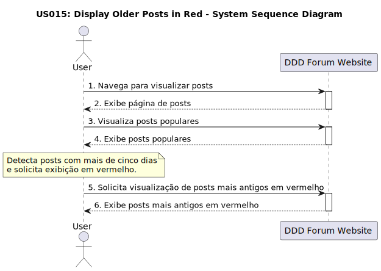

# US 015 - Popular posts older than five days are in red

## 1. Requirements Engineering

### 1.1. User Story Description

 As a member, when I look at the popular, posts with more than five days should have the date in red text.

### 1.2. Customer Specifications and Clarifications 

**From the specifications document:**

> The ability to view popular posts is available to all users of the forum.

> Messages older than five days will be highlighted with the date in red text.

**From the client clarifications:**

> **Question:** 
> How will the hours be counted to make the post five days old?
>  
> **Answer:** 
>  The hours will be counted from the moment the post was submitted, considering that a day has 24 hours

> **Question:** 
>  Are posts older than five days considered popular?
>
> **Answer:** 
>  Yes, they are.

### 1.3. Acceptance Criteria

* **AC1:** Posts older than five days should have the date shown in red text.
* **AC2:** The hours will be counted from the moment the post was submitted, considering that a day has 24 hours.

### 1.4. Found out Dependencies

* There is a dependency to "US003: Create a post" because the post submission date is used to calculate the post age.

### 1.5 Input and Output Data

**Input Data:**

* Displayed posts: Determine post age for date coloration.

**Output Data:**

* Displayed posts: Posts older than five days should have the date shown in red text.

### 1.6. System Sequence Diagram (SSD)

### 1.7 Other Relevant Remarks

* The calculation of the popularity of publications should take into account the count of views and engagement metrics.
Date colouring should be consistent across the platform.

### 1.8. Sequence Diagram

